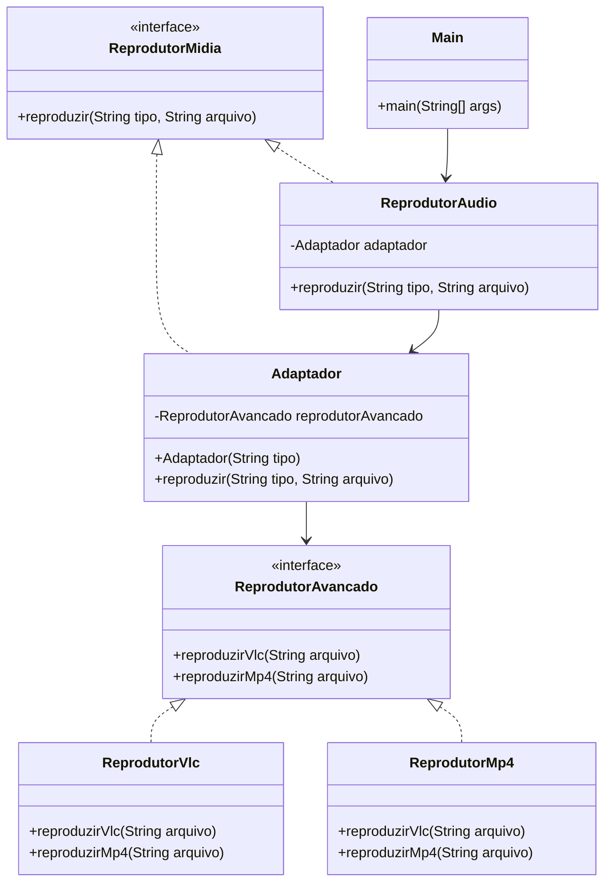

# Padrão Adapter

## Motivação

Em um sistema de reprodução de mídia, precisamos lidar com diferentes formatos de arquivos, como MP3, VLC e MP4. O problema é que a interface atual só suporta MP3, enquanto VLC e MP4 exigem uma interface mais complexa. Para resolver isso, usamos o padrão Adapter, que atua como um intermediário, permitindo que o sistema reproduza todos os formatos sem precisar alterar a interface original. 

## Diagrama UML

## Participantes

### **ReprodutorMidia (Target)**:
- Define a interface esperada pelo cliente.
- No código: Interface `ReprodutorMidia` com o método `reproduzir(String tipo, String arquivo)`.

### **ReprodutorAvancado (Adaptee)**:
- Interface que possui funcionalidades específicas para formatos avançados.
- No código: Interface `ReprodutorAvancado` com os métodos `reproduzirVlc(String arquivo)` e `reproduzirMp4(String arquivo)`.

### **ReprodutorVlc e ReprodutorMp4 (Implementações do Adaptee)**:
- Implementam a interface `ReprodutorAvancado` para formatos específicos.
- No código: Classes `ReprodutorVlc` e `ReprodutorMp4`.

### **Adaptador (Adapter)**:
- Adapta a interface `ReprodutorAvancado` para a interface `ReprodutorMidia`.
- No código: Classe `Adaptador` que implementa `ReprodutorMidia` e usa `ReprodutorAvancado`.

### **ReprodutorAudio (Client)**:
- Utiliza a interface `ReprodutorMidia` para reproduzir mídias.
- No código: Classe `ReprodutorAudio` que usa o `Adaptador` para formatos avançados.
